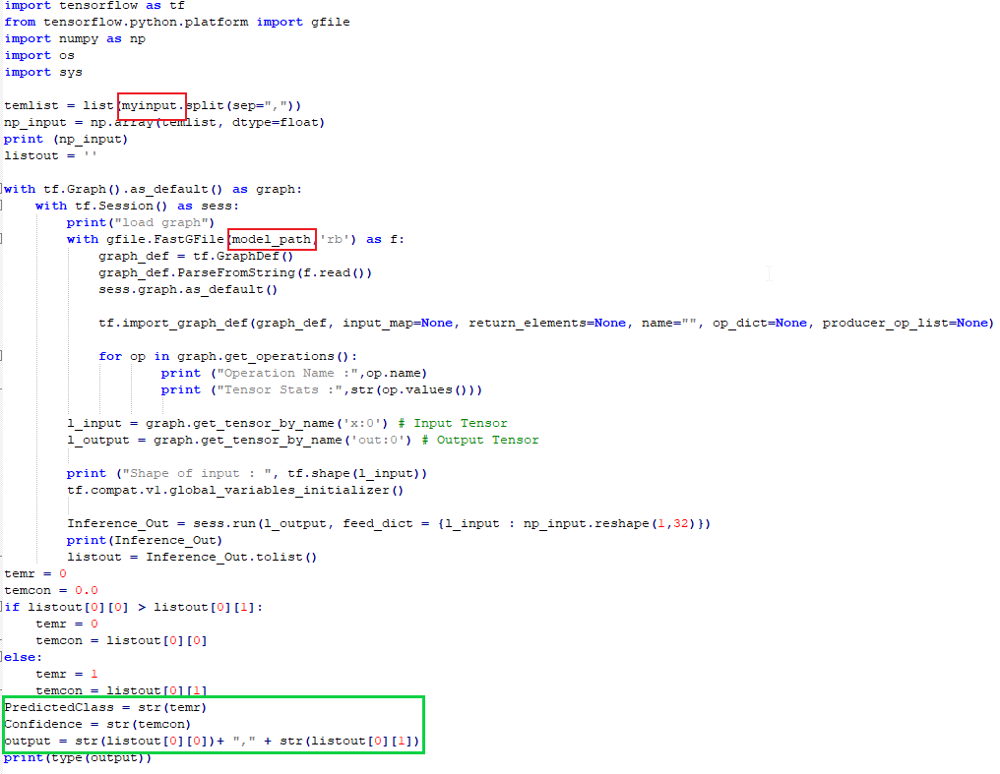
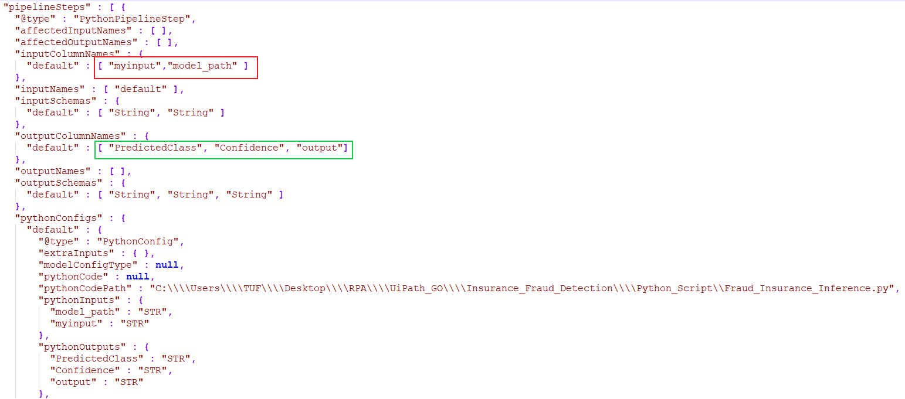
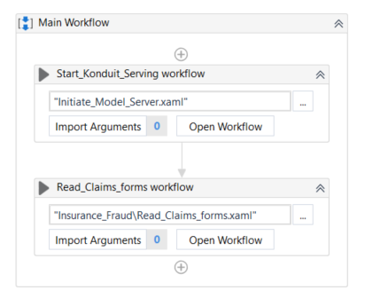
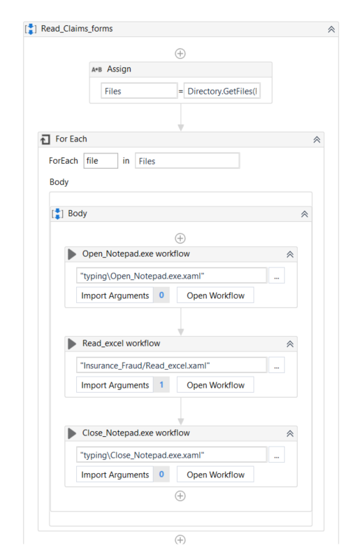
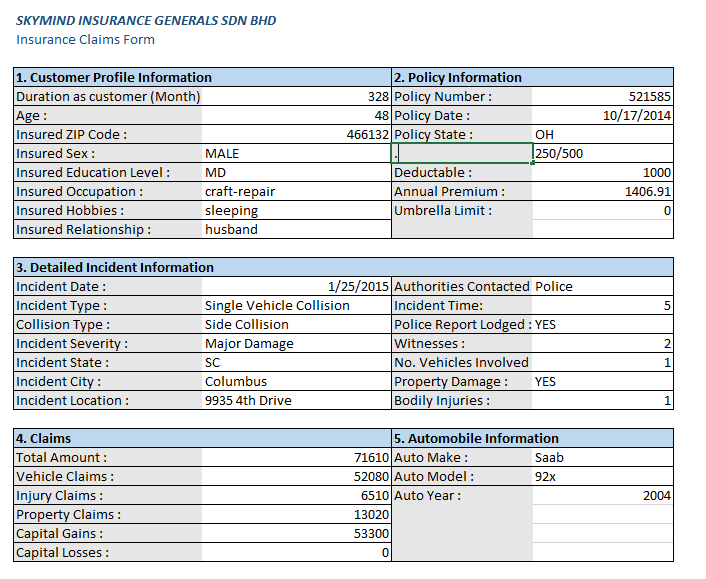
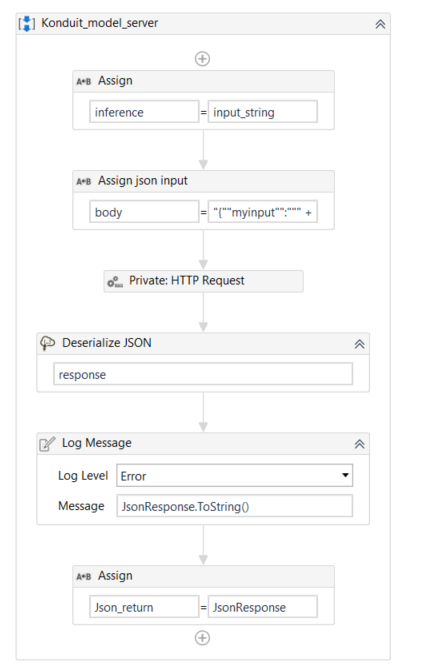

# RPA(UiPath) & AI : Insurance Fraud Detection Use Cases

## Description:
Insurance Fraud Detection is a sample use case that integrates RPA (UiPath) & AI in solving real world business process.  
This use case uses an open source dataset for demo purpose. The description below explains how the workflow works.  

## File Description:  
**Main.xaml:** The main entry point. This is the main workflow to execute.  

**ConfigureKonduitServing.xaml:** This is the primary workflow to initiate Konduit-serving model server.
It handle model server folder exitstance, download, process id checking and start up model serving system.    

**ReadClaimForms.xaml:** This is the primary workflow for insurance fraud detection demo, it handles forms reading, 
features extraction, data convertion and result display.  

**GetInferenceResults.xaml:** This workflow handles the interaction between RPA and Konduit-serving system. 
It generates json format POST request and sent to model server, then it wait for server to return an response in json format.
The returned response is the inference result.  

**Note: 
If you intend to customize the workflow by leveraging this demo, do replace "ReadClaimForms.xaml" with your respective claim forms extraction workflow. You can continue to use "GetInferenceResults.xaml" but remember to modify the POST request input variable.** 
 
## How to Run the Workflow: 
1. Download [distro.zip](https://github.com/skymindglobal/rpa-ai-template/releases/download/v1.0/distro.zip) and unzip to the root file directory.
2. Download [data.zip](https://drive.google.com/open?id=18cN0s2eqy6FJDQsomx5eL0vBQg928x51) and unzip to the root file directory.
3. Run Main.xaml

## Model Serving :  
Konduit-Serving is a serving system and framework focused on deploying machine learning pipelines to production.  
The strength of konduit model serving system is it able to serve wide varieties of python machine learning framework and DL4J framework. 
These framework are included Tensorflow, Keras, DL4J and etc.  
&nbsp;   
If you wish to know more about Konduit model serving, please refer to the below github page:  
**https://github.com/KonduitAI/konduit-serving**  

### To customize your own script(python):    

Similar to how you perform inference(prediction), you can write a python script to serve your model.  

### Example in Python with Tensorflow Model
  

You will notice that in the picture above consist of red boxes and green box. These 2 boxes contain variables which is needed by Konduit-Serving for the insurance fraud detection demo.  

**Red box:**  
- **myinput** & **model_path** are the input variables that define when serving python script.  

**Green box:**  
- **PredictedClass** , **Confidence** &  **output** are the output variables that define when serving python script.  
&nbsp;  
_Note: These variables are necessary to be specified in the Konduit-Serving configuration file (.json)
In this demo: The configuration file is named inference-fraud-config*.json_
&nbsp;  
### Example showing configuration file for Konduit-Serving  
&nbsp;  
  
&nbsp;  
Since the variables above already specified in the Konduit-Serving configuration file, the python script will be executed during a POST request and the specified values will be returned in json format to the client side.  
&nbsp;    
### **Sample POST request input (json) :**   
&nbsp;  
")  
&nbsp;  
&nbsp;  
### **Sample POST request output (json) :**   
&nbsp;  
") 
&nbsp;  
## RPA(UiPath) Workflow :  
&nbsp;  
RPA workflow for Insurance fraud detection demo is created based on a readily available dataset. By applying the similar concept of extracting variable from various type of forms (excel, web forms, pdf & etc.), this demo is intended to showcase the feasiblity of RPA workflow with AI integration. If you intend to modify this demo to fit to their own business process, please follow the steps below.  
&nbsp;  
### Preserve Workflow (just use it) :  
&nbsp;  
")  
&nbsp;  
"ConfigureKonduitServing.xaml" is a mandatory workflow that needed to be initiated before any other workflow started. There are nothing much needed to be change in 
"ConfigureKonduitServing.xaml" workflow. if you are using your own python script to serve, please refer above "Model Serving" steps to understand how to configure your 
own script in serving.  
&nbsp;  
### Main.xaml Workflow :  
&nbsp;  
  
&nbsp;  
This is the start up point of whole workflow. You can see that the very first workflow to start with always to initiate konduit model serving system.
If you intended to create your own workflow, please do keep in mind that just leverage the "ConfigureKonduitServing.xaml" and always start this workflow before any subsequence
workflow.  
&nbsp;  
### ReadClaimForms.xaml Workflow :  
&nbsp;  
  
&nbsp;  
This Workflow is customize base on current available claim forms format. Please do note that this workflow is not generic workflow. You should create your own forms reading workflow to extract out features from your own forms format (web forms, PDF, excel and etc.).  
In this workflow, basically the main process incharge will be extract data table (GetEachValue.xaml) from excel form (refer to Sample Forms image)---> map each extracted feature with pre-instant dictionary list(Transformation.xaml)--->perform normalization (Transformation.xaml) ---> append all the features in an array list---> return the array list ---> sent to Konduit-Serving for inference (GetInferenceResults.xaml) ---> catagorize result(TransformOutputData.xaml).  
&nbsp;  
  
&nbsp;  
### GetInferenceResults.xaml Workflow :  
&nbsp;  
  
&nbsp;  
This workflow can be leverage as client https POST request workflow. The main function of this workflow is to sent a POST request to Konduit-Serving system and get a prediction result back from the system (in json format). The changes will happen on the body of POST request and the endpoint variable (if you change your port).  
As you changes your script input and output serving variable, you will need to change the body of POST request (refer to Sample POST request input (json)).  
&nbsp;  

# Reach us for RPAxAI workflow customization
If you encounter roadblocks in customizing your RPA & AI workflow, we strongly encourage you to reach us anytime!  

### **Webpage @ https://konduit.ai/**  
### **contact page @ https://konduit.ai/contact/**  
### **enquiry @ hello@konduit.ai**  
